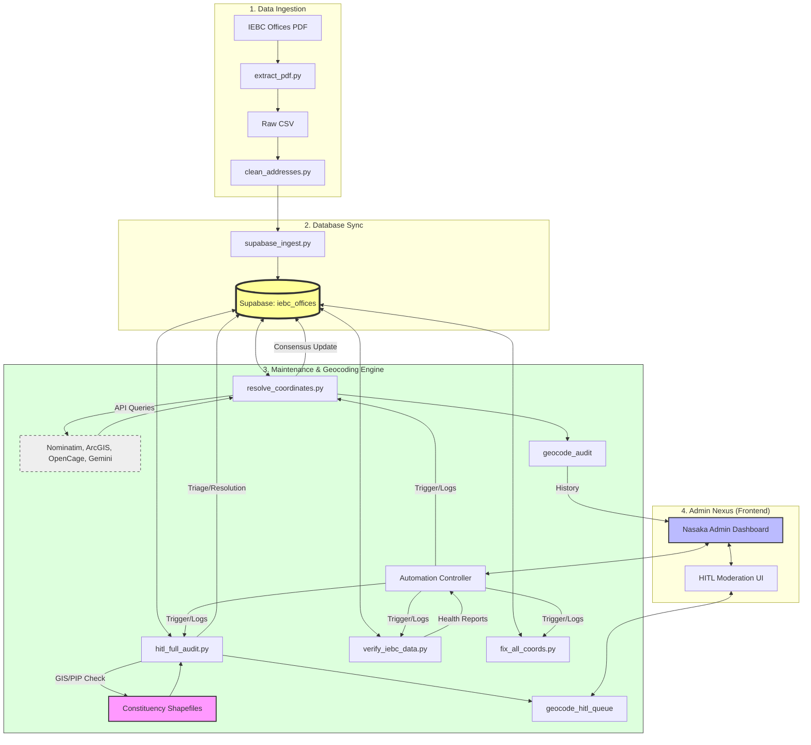

# Pipeline Execution Guide — Nasaka IEBC

All scripts live in `scripts/`. Run them from the project root.

---

## 🎨 ARCHITECTURAL FLOWCHART (HAM MODE)



---

## ⚡ THE ULTIMATE CLEANUP RUN (GOD MODE)
For a perfect, production-ready dataset with **zero overlaps** and **100% PIP validation**, run these exact commands in order:

### 1. The "Big Wipe" (HITL Audit)
This triangulates every office against the official shapefile and re-pins errors with high-precision geocoders.

**Command (Bash/zsh):**
```bash
python scripts/hitl_full_audit.py \
  --shapefile "d:\CEKA\NASAKA\layers\constituencies.shp" \
  --apply \
  --output "outputs/final_audit_report.csv"
```

**Command (PowerShell/Windows):**
```powershell
python scripts/hitl_full_audit.py `
  --shapefile "d:\CEKA\NASAKA\layers\constituencies.shp" `
  --apply `
  --output "outputs/final_audit_report.csv"
```

> [!TIP]
> In PowerShell, the line continuation character is the backtick (**`**), not the backslash (**\**).
> [!IMPORTANT]
> - Removed `--max 100` to process **all** offices.
> - Using `.shp` is more reliable than GeoJSON for encoding.
> - 100% of variants (e.g., "Nairobi City", "Tharaka - Nithi") are handled automatically.

### 2. The "Deep Resolver" (Multi-Source Geocoding)
Runs the weighted consensus engine on whatever remains or needs fresh coordinates.
```bash
python scripts/resolve_coordinates.py --all --apply
```

### 3. The "Final Health Stamp"
Validates the entire database for any remaining edge cases.
```bash
python scripts/verify_iebc_data.py --auto-fix
```

---

## 🔴 SCRIPT DETAILS & VARIANTS

### 1. HITL Full Audit (`hitl_full_audit.py`)
**Purpose**: GIS-validated triage. It detects if an office is outside its constituency and moves it back.
- **Auto-Normalization**: Handles `Small Caps`, `Extra Spaces`, and `County vs Name` variants.
- **Precision Re-Pinning**: Uses Consensus + PIP checks (Point-in-Polygon).

### 2. Coordinate Resolver (`resolve_coordinates.py`)
**Purpose**: The "Brain" of the geocoding.
- **Sources**: Nominatim, ArcGIS (Gold Standard), OpenCage, and Gemini AI (Fallback).
- **Parity**: Shares the same normalization logic as the auditor.

---

## 🟢 FREQUENTLY ASKED QUESTIONS

**Q: Does it handle "Tharaka - Nithi" (with spaces)?**  
**A: YES.** Both scripts normalize `\s*-\s*` to `-` and `.upper()` all strings before indexing.

**Q: Can I run this from the Admin Nexus?**  
**A: YES.** Go to **Automation Runner** → **Full HITL Audit**. It is now wired with live progress tracking nodes.

**Q: What about "Elegeyo-Marakwet" vs "Elgeyo-Marakwet"?**  
**A: FIXED.** Added hardcoded spelling variant normalization (STRICT MODE).

---

## 🛠️ ADMIN TROUBLESHOOTING
- **422 Unprocessable Content**: Check your `.env` for `SUPABASE_SERVICE_ROLE_KEY`. Only Service Role has bypass-RLS permissions.
- **403 Forbidden**: Geocoding API keys (ArcGIS/OpenCage) have reached their daily limit.
- **Missing Task Tracking**: Ensure `admin_tasks` table is present (Check `SCHEMA_AUDIT.md`).
