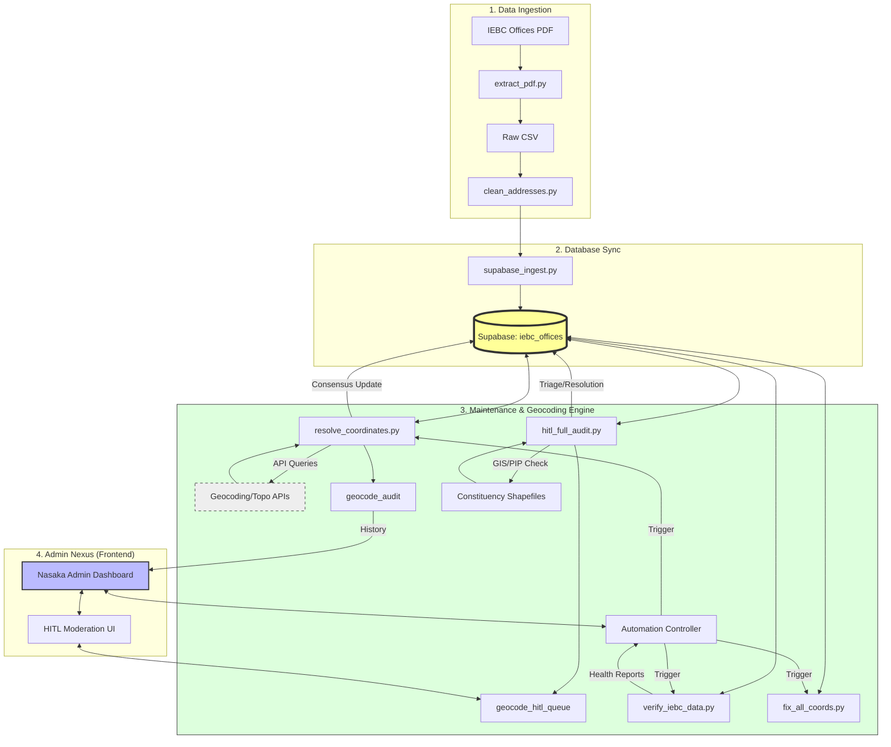

# Pipeline Execution Guide — Nasaka IEBC

All scripts live in `scripts/`. Run from the project root.

---

## 🎨 ARCHITECTURAL FLOWCHART



---

## 🔴 CORE PIPELINES (Data-Critical)

### 1. Coordinate Resolver (`resolve_coordinates.py`)
**Purpose**: Multi-source AI geocoding with cross-validation. The main geocoding engine.
```bash
# Resolve all unresolved offices
python scripts/resolve_coordinates.py

# Re-resolve specific constituency
python scripts/resolve_coordinates.py --constituency "EMBAKASI EAST"

# Dry run (no DB writes)
python scripts/resolve_coordinates.py --dry-run
```
**Status**: ✅ Patched (v10 — AI bypass + county normalization fixed)

---

### 2. HITL Full Audit (`hitl_full_audit.py`) 🆕
**Purpose**: Shapefile PIP-validated queue cleanup + precision re-pinning.
```bash
# Dry run — triage only (SAFE)
python scripts/hitl_full_audit.py --shapefile "d:\CEKA\NASAKA\layers\constituencies.shp" --dry-run-report

# Apply cleanup + re-pin
python scripts/hitl_full_audit.py --shapefile "d:\CEKA\NASAKA\layers\constituencies.shp" --apply

# Small batch test
python scripts/hitl_full_audit.py --shapefile "d:\CEKA\NASAKA\layers\constituencies.shp" --apply --max 10
```
**Deps**: `geopandas`, `shapely`, shapefile at `d:\CEKA\NASAKA\layers\constituencies.shp`

---

### 3. IEBC Data Verifier (`verify_iebc_data.py`)
**Purpose**: Daily health check — null coords, out-of-bounds, county mismatches, clusters, duplicates.
```bash
# Quick mode
python scripts/verify_iebc_data.py --quick

# Full verification + auto-fix
python scripts/verify_iebc_data.py --auto-fix

# JSON report only
python scripts/verify_iebc_data.py --report-only
```

---

### 4. Coordinate Fixer (`fix_all_coords.py`)
**Purpose**: Apply hardcoded corrections for known misplacements.
```bash
# Dry run (default)
python scripts/fix_all_coords.py

# Apply to database
python scripts/fix_all_coords.py --apply
```

---

## 🟡 DATA INGESTION PIPELINES

### 5. Full Data Pipeline (`data-pipeline/pipeline.py`)
**Purpose**: Complete PDF → Clean → Geocode → DB ingestion pipeline.
```bash
python scripts/data-pipeline/pipeline.py --pdf-path data/raw/iebc_offices.pdf
```

### 6. Supabase Ingest (`supabase_ingest.py`)
**Purpose**: Bulk insert cleaned CSV data to Supabase.
```bash
python scripts/supabase_ingest.py --input data/processed/cleaned_iebc_offices.csv
```

### 7. GeoJSON Uploader (`upload_geojson_to_supabase.py`)
**Purpose**: Push generated GeoJSON to Supabase storage.
```bash
python scripts/upload_geojson_to_supabase.py
```

---

## 🟢 TRANSFORMATION & CLEANUP SCRIPTS

| # | Script | Purpose | Command |
|---|--------|---------|---------|
| 8 | `clean_addresses.py` | Normalize addresses | `python scripts/clean_addresses.py` |
| 9 | `csv_to_geojson.py` | Convert CSV → GeoJSON | `python scripts/csv_to_geojson.py` |
| 10 | `extract_pdf.py` | Extract tables from IEBC PDF | `python scripts/extract_pdf.py` |
| 11 | `geocode_addresses.py` | Basic multi-service geocoding | `python scripts/geocode_addresses.py` |
| 12 | `geocode_addresses_nominatim.py` | Nominatim-only geocoding | `python scripts/geocode_addresses_nominatim.py` |
| 13 | `update_iebc_coords.py` | Batch coordinate updates | `python scripts/update_iebc_coords.py` |
| 14 | `update_office_names.py` | Office name normalization | `python scripts/update_office_names.py` |
| 15 | `validate_data.py` | Schema validation | `python scripts/validate_data.py` |

---

## 🔵 ADMIN & UTILITY

| # | Script | Purpose | Command |
|---|--------|---------|---------|
| 16 | `check_hitl_count.py` | Quick HITL queue count | `python scripts/check_hitl_count.py` |
| 17 | `grant_admin_local.py` | Grant admin to local user | `python scripts/grant_admin_local.py` |
| 18 | `admin_task_lib.py` | Shared admin task utilities | *(library, not runnable)* |

---

## Recommended Run Order

For a full cleanup pass, run in this order:

```
1. hitl_full_audit.py --dry-run-report     ← See what's in the queue
2. hitl_full_audit.py --apply              ← Clean up + re-pin
3. verify_iebc_data.py --quick             ← Verify the state after cleanup
4. resolve_coordinates.py --dry-run        Catch any remaining unresolved
5. resolve_coordinates.py                  ← Apply fixes
6. verify_iebc_data.py                     ← Final full verification
```

---

## Q2: Does It Handle Small Caps Variants?

**Yes.** The `normalize_county()` function in `resolve_coordinates.py` calls `.upper()` as its very first operation, so `"kisii"`, `"Kisii"`, `"KISII"`, and `"kIsIi"` all normalize to `"KISII"`. Same applies in `hitl_full_audit.py`'s `ConstituencyIndex._norm()`.

Additionally, these variants are now handled:
- `"Tharaka - Nithi"` → `"THARAKA-NITHI"` (space around hyphen)
- `"Nairobi County"` → `"NAIROBI"` (suffix stripped)
- `"Nairobi City"` → `"NAIROBI"` (city variant)
- `"Elegeyo-Marakwet"` → `"ELGEYO-MARAKWET"` (spelling variant)
- `"HomaBay"` → `"HOMA BAY"` (missing space)
- `"Murang'a"` / `"Murang'a"` / `` Murang`a `` (curly quotes → straight)

---

## Q3: Can You Manage All From Admin Nexus?

**Partially — here's the current state:**

| Feature | Admin Nexus Tab | Status |
|---------|----------------|--------|
| Run verification (`verify_iebc_data.py`) | AutomationRunner → "IEBC Data Verification" | ✅ Works |
| Run coord fixer (`fix_all_coords.py`) | AutomationRunner → "Coordinate Fixer" | ✅ Works |
| Run resolver (`resolve_coordinates.py`) | AutomationRunner → "Coordinate Resolver" | ✅ Works |
| Review HITL entries | HITLModeration tab | ✅ Works |
| Run `hitl_full_audit.py` | AutomationRunner → "Full HITL & Shapefile Audit" | ✅ Wired |
| Sitemap regeneration | AutomationRunner → "Sitemap Regenerator" | ✅ Works |

---

## Q4: Is the Admin Access Issue Fixed?

**The auth code itself looks correct** — it checks `core_team.is_admin && is_active` at both:
1. **Login** (line 136-147 of `App.tsx`)
2. **Route guard** (line 323-339 of `App.tsx`)

---

## 🛠️ TROUBLESHOOTING

If you see **404 Not Found** errors for `admin_tasks` or `admin_task_logs` in the console, the tables are missing in the current Supabase project. 

**Wait for Antigravity to finish applying the database schema fixes.**
